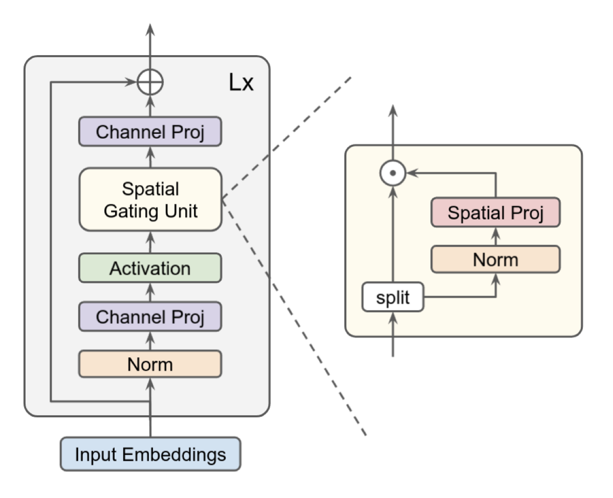

# gMLP

PyTorch implementation of [Pay Attention to MLPs](https://arxiv.org/abs/2105.08050).

<p align="center">
  
</p>

## Quickstart

Clone this repository.

```
git clone https://github.com/jaketae/g-mlp.git
```

Navigate to the cloned directory. You can use the barebone gMLP model via

```python
>>> from g_mlp import gMLP
>>> model = gMLP()
```

By default, the model comes with the following parameters:

```python
gMLP(
    d_model=256,
    d_ffn=512,
    seq_len=256,
    num_layers=6,
)
```

## Usage

The repository also contains gMLP models specifically for language modeling and image classification.

### NLP

`gMLPForLanguageModeling` shares the same default parameters as `gMLP`, with `num_tokens=10000` as an added parameter that represents the size of the token embedding table.

```python
>>> import torch
>>> from g_mlp import gMLPForLanguageModeling
>>> model = gMLPForLanguageModeling()
>>> x = torch.randint(0, 10000, (8, 256))
>>> model(x).shape
torch.Size([8, 256, 256])
```

### Computer Vision

`gMLPForImageClassification` is a ViT-esque version of gMLP that includes a patch creating layer and a final classification head. Below is an example usage.

```python
>>> import torch
>>> from g_mlp import gMLPForImageClassification
>>> model = gMLPForImageClassification()
>>> x = torch.randn(8, 3, 256, 256)
>>> model(x).shape
torch.Size([8, 1000])
```

## Summary

The authors of the paper present gMLP, an an attention-free all-MLP architecture based on spatial gating units. gMLP achieves parity with transformer models such as ViT and BERT on language and vision downstream tasks. The authors also show that gMLP scales with increased data and number of parameters, suggesting that self-attention is not a necessary component for designing performant models.

## Resources

-   [Original Paper](https://arxiv.org/abs/2105.08050)
-   [Phil Wang's implementation](https://github.com/lucidrains/g-mlp-pytorch)
